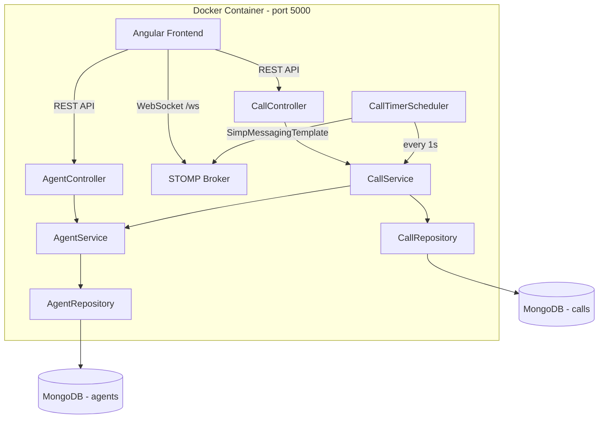
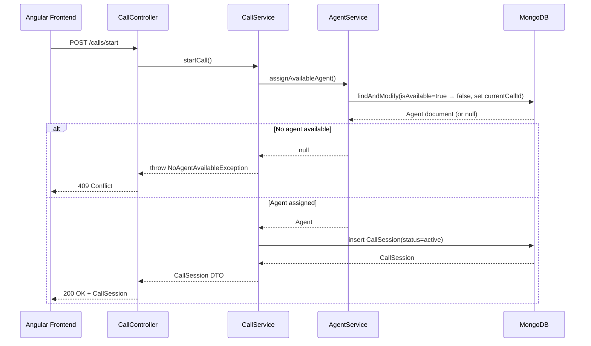

# Design Document: call-service

## Overview

The call-service is a Spring Boot 4.0.6 microservice (Java 17) that powers the call simulation workflow for WeMakeCalls. It exposes a REST API for managing agent availability, call session lifecycle, and feedback collection, while delivering real-time call timer updates to the Angular frontend via WebSocket/STOMP. All data is persisted in MongoDB.

The service is stateless at the HTTP layer — all state lives in MongoDB — making it straightforward to run in Docker on port 5000. A scheduled task drives the per-second timer ticks for active calls, publishing elapsed durations over STOMP topics that the frontend subscribes to.

### Key Design Decisions

| Decision | Rationale |
|----------|-----------|
| Spring Scheduling for timer ticks | Simpler than a dedicated thread pool; `@Scheduled(fixedRate=1000)` iterates active calls and publishes via `SimpMessagingTemplate` |
| MongoDB atomic updates for agent state | `findAndModify` with query conditions prevents double-assignment without distributed locks |
| Enum-based hangup reasons | Compile-time safety; Jackson deserializes strings to the enum, returning 400 on mismatch |
| STOMP over raw WebSocket | STOMP gives topic-based pub/sub out of the box, matching the Angular `@stomp/stompjs` client |

## Architecture



### Request Flow: Start Call



## Components and Interfaces

### REST Controllers

#### AgentController
| Method | Endpoint | Description | Response |
|--------|----------|-------------|----------|
| GET | `/agents/available` | Returns agents where `isAvailable=true` | `List<AgentDTO>` (200) |

#### CallController
| Method | Endpoint | Description | Response |
|--------|----------|-------------|----------|
| POST | `/calls/start` | Starts a new call, assigns an agent | `CallSessionDTO` (200) or 409 |
| POST | `/calls/end/{callId}` | Ends an active call | `CallSessionDTO` (200), 404, or 409 |
| POST | `/calls/feedback/{callId}` | Submits hangup reason + rating | `CallSessionDTO` (200), 400, or 404 |
| GET | `/calls/history` | Returns all calls ordered by start time desc | `List<CallSessionDTO>` (200) |

### Service Layer

#### AgentService
```java
public interface AgentService {
    List<Agent> getAvailableAgents();
    Agent assignAvailableAgent(String callId);
    void releaseAgent(String agentId);
}
```

#### CallService
```java
public interface CallService {
    CallSession startCall();
    CallSession endCall(String callId);
    CallSession submitFeedback(String callId, HangupReason reason, int rating);
    List<CallSession> getCallHistory();
    List<CallSession> getActiveCalls();
}
```

### Scheduler

#### CallTimerScheduler
- Runs at `@Scheduled(fixedRate = 1000)` (every 1 second)
- Queries active calls from `CallService.getActiveCalls()`
- For each active call, calculates elapsed seconds from `callStarted` to now
- Publishes to STOMP topic `/topic/call-timer/{callId}` with the elapsed duration

### WebSocket Configuration

#### WebSocketConfig
- Registers STOMP endpoint at `/ws`
- Enables simple broker on `/topic`
- Configures allowed origins for the Angular frontend (CORS)

### Exception Handling

#### GlobalExceptionHandler (`@RestControllerAdvice`)
- `NoAgentAvailableException` → 409 Conflict
- `CallNotFoundException` → 404 Not Found
- `CallAlreadyEndedException` → 409 Conflict
- `InvalidFeedbackException` → 400 Bad Request

## Data Models

### MongoDB Documents

#### CallSession (collection: `calls`)
```java
@Document(collection = "calls")
public class CallSession {
    @Id
    private String id;           // MongoDB-generated, serves as callId
    private String agentId;
    private String agentName;
    private Instant callStarted;
    private Instant callEnded;   // null while active
    private Long durationSeconds; // null while active
    private HangupReason hangupReason; // null until feedback submitted
    private Integer agentRating;       // null until feedback submitted
    private CallStatus status;         // ACTIVE or COMPLETED
}
```

#### Agent (collection: `agents`)
```java
@Document(collection = "agents")
public class Agent {
    @Id
    private String id;           // MongoDB-generated, serves as agentId
    private String name;
    private boolean isAvailable;
    private String currentCallId; // null when available
}
```

### Enums

#### HangupReason
```java
public enum HangupReason {
    ISSUE_RESOLVED("Issue Resolved"),
    WRONG_DEPARTMENT("Wrong Department"),
    LONG_WAIT_TIME("Long Wait Time"),
    CALL_DROPPED("Call Dropped"),
    OTHER("Other");

    private final String displayName;
    // constructor, getter, @JsonValue/@JsonCreator for serialization
}
```

#### CallStatus
```java
public enum CallStatus {
    ACTIVE,
    COMPLETED
}
```

### DTOs

#### CallSessionDTO
```java
public record CallSessionDTO(
    String callId,
    String agentId,
    String agentName,
    Instant callStarted,
    Instant callEnded,
    Long durationSeconds,
    String hangupReason,
    Integer agentRating,
    String status
) {}
```

#### AgentDTO
```java
public record AgentDTO(
    String agentId,
    String name
) {}
```

#### FeedbackRequest
```java
public record FeedbackRequest(
    String hangupReason,
    int agentRating
) {}
```

#### TimerMessage
```java
public record TimerMessage(
    String callId,
    long elapsedSeconds
) {}
```


## Correctness Properties

*A property is a characteristic or behavior that should hold true across all valid executions of a system — essentially, a formal statement about what the system should do. Properties serve as the bridge between human-readable specifications and machine-verifiable correctness guarantees.*

### Property 1: Available agents filter

*For any* set of Agent documents in MongoDB with mixed `isAvailable` values, calling `getAvailableAgents()` SHALL return exactly those agents where `isAvailable` is true, each containing a non-null `agentId` and `name`.

**Validates: Requirements 1.1, 1.2**

### Property 2: Call start produces valid session

*For any* agent pool containing at least one available agent, calling `startCall()` SHALL return a CallSession with status `ACTIVE`, a non-null `callId`, `agentId`, `agentName`, and a `callStarted` timestamp that is not in the future.

**Validates: Requirements 2.1, 2.3**

### Property 3: Agent becomes unavailable on assignment

*For any* successful call start, the assigned agent's document SHALL have `isAvailable` set to false and `currentCallId` set to the new call's identifier immediately after the operation.

**Validates: Requirements 2.2, 8.1**

### Property 4: Duration calculation correctness

*For any* two instants `start` and `end` where `end >= start`, the computed duration SHALL equal `Duration.between(start, end).getSeconds()`. This applies both to the live elapsed timer and the final `durationSeconds` field on call completion.

**Validates: Requirements 3.2, 4.2**

### Property 5: Only active calls receive timer ticks

*For any* mix of CallSession documents with statuses `ACTIVE` and `COMPLETED`, the scheduler SHALL only publish timer messages for sessions with status `ACTIVE`.

**Validates: Requirements 3.3**

### Property 6: End call completes session

*For any* CallSession with status `ACTIVE`, calling `endCall(callId)` SHALL transition the session to status `COMPLETED` with a non-null `callEnded` timestamp and a `durationSeconds` value greater than or equal to zero.

**Validates: Requirements 4.1**

### Property 7: Agent released on call end

*For any* call that transitions from `ACTIVE` to `COMPLETED`, the previously assigned agent's document SHALL have `isAvailable` set to true and `currentCallId` set to null.

**Validates: Requirements 4.3, 8.2**

### Property 8: Feedback round-trip persistence

*For any* completed CallSession and any valid feedback (hangup reason from the allowed set, rating in [1,5]), calling `submitFeedback()` SHALL result in the CallSession document containing exactly the submitted `hangupReason` and `agentRating` values.

**Validates: Requirements 5.1**

### Property 9: Invalid feedback rejection

*For any* string that is not one of the five valid hangup reasons, OR any integer outside the range [1,5], the feedback submission SHALL be rejected without modifying the CallSession document.

**Validates: Requirements 5.2, 5.3**

### Property 10: Call history ordering

*For any* set of CallSession documents in MongoDB, calling `getCallHistory()` SHALL return them ordered by `callStarted` descending, with each entry containing all fields (`callId`, `agentId`, `agentName`, `callStarted`, `callEnded`, `durationSeconds`, `hangupReason`, `agentRating`, `status`).

**Validates: Requirements 6.1, 6.2**

### Property 11: No double-assignment invariant

*For any* sequence of `startCall()` operations, no agent SHALL be assigned to more than one active call simultaneously — i.e., an agent with `isAvailable=false` is never selected for assignment.

**Validates: Requirements 8.3**

## Error Handling

### Exception Hierarchy

| Exception | HTTP Status | Trigger |
|-----------|-------------|---------|
| `NoAgentAvailableException` | 409 Conflict | `startCall()` when no agents have `isAvailable=true` |
| `CallNotFoundException` | 404 Not Found | `endCall()` or `submitFeedback()` with non-existent `callId` |
| `CallAlreadyEndedException` | 409 Conflict | `endCall()` on a session with status `COMPLETED` |
| `InvalidFeedbackException` | 400 Bad Request | Invalid hangup reason or rating outside [1,5] |

### Global Exception Handler

A `@RestControllerAdvice` class maps exceptions to structured error responses:

```java
@RestControllerAdvice
public class GlobalExceptionHandler {

    @ExceptionHandler(NoAgentAvailableException.class)
    public ResponseEntity<ErrorResponse> handleNoAgent(NoAgentAvailableException ex) {
        return ResponseEntity.status(409).body(new ErrorResponse(ex.getMessage()));
    }

    @ExceptionHandler(CallNotFoundException.class)
    public ResponseEntity<ErrorResponse> handleNotFound(CallNotFoundException ex) {
        return ResponseEntity.status(404).body(new ErrorResponse(ex.getMessage()));
    }

    @ExceptionHandler(CallAlreadyEndedException.class)
    public ResponseEntity<ErrorResponse> handleAlreadyEnded(CallAlreadyEndedException ex) {
        return ResponseEntity.status(409).body(new ErrorResponse(ex.getMessage()));
    }

    @ExceptionHandler(InvalidFeedbackException.class)
    public ResponseEntity<ErrorResponse> handleInvalidFeedback(InvalidFeedbackException ex) {
        return ResponseEntity.status(400).body(new ErrorResponse(ex.getMessage()));
    }
}
```

### Error Response Format

```java
public record ErrorResponse(String message) {}
```

### Validation Strategy

- **Hangup reason**: Jackson `@JsonCreator` on `HangupReason` enum throws `InvalidFeedbackException` on unknown values
- **Agent rating**: Validated in `CallService.submitFeedback()` before persistence — rejects values < 1 or > 5
- **Call ID existence**: Repository lookup returns `Optional<CallSession>`; empty triggers `CallNotFoundException`
- **Call status**: Checked before ending — if already `COMPLETED`, throws `CallAlreadyEndedException`

## Testing Strategy

### Unit Tests (Example-Based)

Unit tests cover specific scenarios, edge cases, and error conditions:

- **AgentService**: Empty agent pool returns empty list; single available agent is returned; unavailable agents are excluded
- **CallService.startCall()**: No available agents throws `NoAgentAvailableException`; successful start returns complete DTO
- **CallService.endCall()**: Non-existent callId throws `CallNotFoundException`; already-completed call throws `CallAlreadyEndedException`
- **CallService.submitFeedback()**: Non-existent callId throws `CallNotFoundException`; each invalid hangup reason string is rejected; ratings 0, -1, 6, 100 are rejected
- **Controller layer**: MockMvc tests verifying HTTP status codes and response bodies for each endpoint
- **WebSocket config**: Smoke test verifying STOMP handshake at `/ws`

### Property-Based Tests

Property-based tests verify universal correctness properties across generated inputs. The project will use **jqwik** (JUnit 5 property-based testing library for Java).

**Configuration:**
- Minimum 100 iterations per property test
- Each test tagged with: `Feature: call-service, Property {number}: {property_text}`
- Tests run against service layer with embedded MongoDB (Flapdoodle) or mocked repositories

**Properties to implement:**
1. Available agents filter — generate random agent lists, verify filtering
2. Call start produces valid session — generate agent pools, verify session creation
3. Agent becomes unavailable on assignment — verify state transition
4. Duration calculation correctness — generate random instant pairs, verify arithmetic
5. Only active calls receive timer ticks — generate mixed-status call lists, verify filtering
6. End call completes session — generate active sessions, verify transition
7. Agent released on call end — verify inverse state transition
8. Feedback round-trip persistence — generate valid feedback combos, verify persistence
9. Invalid feedback rejection — generate invalid inputs, verify rejection
10. Call history ordering — generate random call sets, verify sort order
11. No double-assignment invariant — generate sequential call starts, verify uniqueness

### Integration Tests

- **MongoDB persistence**: Verify documents are stored in correct collections with expected fields
- **WebSocket timer**: Verify STOMP messages arrive at ~1s intervals for active calls and stop on completion
- **Full call lifecycle**: Start → timer ticks → end → feedback → history (end-to-end)

### Test Dependencies

```xml
<!-- Add to pom.xml -->
<dependency>
    <groupId>net.jqwik</groupId>
    <artifactId>jqwik</artifactId>
    <version>1.9.1</version>
    <scope>test</scope>
</dependency>
```
