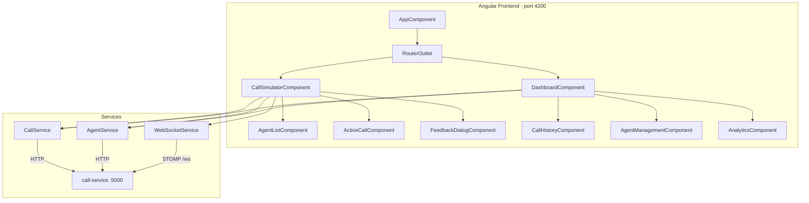
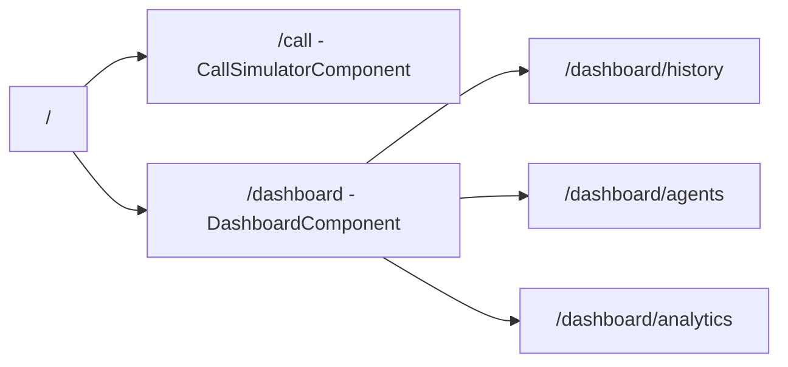

# Design Document: frontend-app

## Overview

The frontend-app is an Angular 18+ single-page application that serves as the user interface for the WeMakeCalls call simulation platform. It provides two primary views: a Call Simulator for initiating and managing live calls with real-time timer updates via WebSocket, and a Dashboard/Admin panel for viewing call history, managing agents, and visualizing analytics.

The application uses PrimeNG as its component library with a custom black-and-green dark theme. It communicates with the call-service backend at `http://localhost:5000` via REST for CRUD operations and STOMP-over-SockJS for real-time call timer streaming. The architecture follows Angular best practices with standalone components, lazy-loaded routes, and injectable services for API and WebSocket communication.

### Key Design Decisions

| Decision | Rationale |
|----------|-----------|
| Standalone components (no NgModules) | Angular 18+ best practice; simpler dependency management and tree-shaking |
| PrimeNG with custom Aura dark theme | Rich component set (tables, charts, dialogs) with built-in dark mode theming support |
| @stomp/stompjs + sockjs-client | Matches the backend STOMP broker; provides auto-reconnect and topic subscription |
| Signals for reactive state | Angular 18 signals provide fine-grained reactivity without RxJS complexity for UI state |
| RxJS for HTTP and WebSocket streams | Natural fit for async data flows, cancellation, and stream composition |
| Lazy-loaded route modules | Keeps initial bundle small; dashboard loads only when navigated to |

## Architecture



### Routing Structure



## Components and Interfaces

### Layout Components

#### AppComponent
**Purpose**: Root shell with navigation sidebar and router outlet.

```typescript
@Component({
  selector: 'app-root',
  standalone: true,
  imports: [RouterOutlet, SidebarModule, ButtonModule],
  templateUrl: './app.component.html'
})
export class AppComponent {
  navItems: MenuItem[] = [
    { label: 'Call Simulator', icon: 'pi pi-phone', routerLink: '/call' },
    { label: 'Dashboard', icon: 'pi pi-chart-bar', routerLink: '/dashboard' }
  ];
}
```

### Call Simulator Components

#### CallSimulatorComponent
**Purpose**: Main call interface orchestrating agent selection, active call display, and feedback submission.

```typescript
@Component({
  selector: 'app-call-simulator',
  standalone: true,
  imports: [AgentListComponent, ActiveCallComponent, FeedbackDialogComponent, ButtonModule, CardModule],
  templateUrl: './call-simulator.component.html'
})
export class CallSimulatorComponent {
  // State signals
  availableAgents = signal<AgentDTO[]>([]);
  activeCall = signal<CallSessionDTO | null>(null);
  elapsedSeconds = signal<number>(0);
  isCallActive = computed(() => this.activeCall() !== null);
  showFeedbackDialog = signal<boolean>(false);

  // Injected services
  private callService = inject(CallService);
  private agentService = inject(AgentService);
  private wsService = inject(WebSocketService);

  startCall(): void;
  endCall(): void;
  onFeedbackSubmitted(feedback: FeedbackRequest): void;
}
```

**Responsibilities**:
- Fetch and display available agents on init
- Start a call via CallService, transition to active call state
- Subscribe to WebSocket timer updates for the active call
- End a call and show feedback dialog
- Submit feedback and reset to idle state

#### AgentListComponent
**Purpose**: Displays available agents in a card grid.

```typescript
@Component({
  selector: 'app-agent-list',
  standalone: true,
  imports: [CardModule, AvatarModule, TagModule]
})
export class AgentListComponent {
  agents = input.required<AgentDTO[]>();
}
```

#### ActiveCallComponent
**Purpose**: Shows the active call with a live timer and agent info.

```typescript
@Component({
  selector: 'app-active-call',
  standalone: true,
  imports: [CardModule, ButtonModule, ProgressSpinnerModule]
})
export class ActiveCallComponent {
  call = input.required<CallSessionDTO>();
  elapsedSeconds = input.required<number>();
  
  formattedTime = computed(() => {
    const mins = Math.floor(this.elapsedSeconds() / 60);
    const secs = this.elapsedSeconds() % 60;
    return `${mins.toString().padStart(2, '0')}:${secs.toString().padStart(2, '0')}`;
  });

  endCall = output<void>();
}
```

#### FeedbackDialogComponent
**Purpose**: Modal dialog for submitting hangup reason and agent rating after a call ends.

```typescript
@Component({
  selector: 'app-feedback-dialog',
  standalone: true,
  imports: [DialogModule, DropdownModule, RatingModule, ButtonModule, FormsModule]
})
export class FeedbackDialogComponent {
  visible = model.required<boolean>();
  callId = input.required<string>();

  hangupReasons: SelectItem[] = [
    { label: 'Issue Resolved', value: 'Issue Resolved' },
    { label: 'Wrong Department', value: 'Wrong Department' },
    { label: 'Long Wait Time', value: 'Long Wait Time' },
    { label: 'Call Dropped', value: 'Call Dropped' },
    { label: 'Other', value: 'Other' }
  ];

  selectedReason = signal<string>('');
  agentRating = signal<number>(0);

  feedbackSubmitted = output<FeedbackRequest>();

  submit(): void;
}
```

### Dashboard Components

#### DashboardComponent
**Purpose**: Container with tabbed navigation for history, agents, and analytics.

```typescript
@Component({
  selector: 'app-dashboard',
  standalone: true,
  imports: [TabMenuModule, RouterOutlet]
})
export class DashboardComponent {
  tabs: MenuItem[] = [
    { label: 'Call History', icon: 'pi pi-list', routerLink: './history' },
    { label: 'Agents', icon: 'pi pi-users', routerLink: './agents' },
    { label: 'Analytics', icon: 'pi pi-chart-line', routerLink: './analytics' }
  ];
}
```

#### CallHistoryComponent
**Purpose**: Paginated table of all past calls with sorting and filtering.

```typescript
@Component({
  selector: 'app-call-history',
  standalone: true,
  imports: [TableModule, TagModule, InputTextModule]
})
export class CallHistoryComponent implements OnInit {
  calls = signal<CallSessionDTO[]>([]);
  loading = signal<boolean>(true);

  private callService = inject(CallService);

  ngOnInit(): void;  // Fetches call history
}
```

#### AgentManagementComponent
**Purpose**: Displays all agents with their availability status.

```typescript
@Component({
  selector: 'app-agent-management',
  standalone: true,
  imports: [TableModule, TagModule, AvatarModule]
})
export class AgentManagementComponent implements OnInit {
  agents = signal<AgentDTO[]>([]);
  loading = signal<boolean>(true);

  private agentService = inject(AgentService);

  ngOnInit(): void;  // Fetches all agents
}
```

#### AnalyticsComponent
**Purpose**: Charts and statistics for call duration, hangup reasons, and agent ratings.

```typescript
@Component({
  selector: 'app-analytics',
  standalone: true,
  imports: [ChartModule, CardModule]
})
export class AnalyticsComponent implements OnInit {
  callDurationData = signal<ChartData | null>(null);
  hangupReasonData = signal<ChartData | null>(null);
  agentRatingData = signal<ChartData | null>(null);

  chartOptions: ChartOptions = {
    plugins: { legend: { labels: { color: '#00ff00' } } },
    scales: { x: { ticks: { color: '#00ff00' } }, y: { ticks: { color: '#00ff00' } } }
  };

  private callService = inject(CallService);

  ngOnInit(): void;  // Fetches history and computes chart data
}
```

## Data Models

### TypeScript Interfaces

```typescript
export interface AgentDTO {
  agentId: string;
  name: string;
}

export interface CallSessionDTO {
  callId: string;
  agentId: string;
  agentName: string;
  callStarted: string;   // ISO 8601 timestamp
  callEnded: string | null;
  durationSeconds: number | null;
  hangupReason: string | null;
  agentRating: number | null;
  status: 'ACTIVE' | 'ENDED';
}

export interface FeedbackRequest {
  hangupReason: string;
  agentRating: number;
}

export interface TimerMessage {
  callId: string;
  elapsedSeconds: number;
}

export type HangupReason =
  | 'Issue Resolved'
  | 'Wrong Department'
  | 'Long Wait Time'
  | 'Call Dropped'
  | 'Other';
```

**Validation Rules**:
- `FeedbackRequest.agentRating` must be between 1 and 5 (inclusive)
- `FeedbackRequest.hangupReason` must be one of the valid `HangupReason` values
- `CallSessionDTO.callId` is a non-empty string (UUID format)

## Key Functions with Formal Specifications

### CallService

```typescript
@Injectable({ providedIn: 'root' })
export class CallService {
  private http = inject(HttpClient);
  private baseUrl = 'http://localhost:5000';

  getAvailableAgents(): Observable<AgentDTO[]>;
  startCall(): Observable<CallSessionDTO>;
  endCall(callId: string): Observable<CallSessionDTO>;
  submitFeedback(callId: string, feedback: FeedbackRequest): Observable<CallSessionDTO>;
  getCallHistory(): Observable<CallSessionDTO[]>;
}
```

**Preconditions:**
- `endCall`: `callId` is non-empty, call exists and has status ACTIVE
- `submitFeedback`: `callId` is non-empty, call exists and has status ENDED, `feedback.agentRating` is 1–5, `feedback.hangupReason` is a valid enum value

**Postconditions:**
- `startCall`: Returns a `CallSessionDTO` with status ACTIVE and a valid `callId`, or throws if no agent available
- `endCall`: Returns a `CallSessionDTO` with status ENDED and non-null `callEnded` timestamp
- `submitFeedback`: Returns a `CallSessionDTO` with non-null `hangupReason` and `agentRating`

### WebSocketService

```typescript
@Injectable({ providedIn: 'root' })
export class WebSocketService {
  private client: Client;
  private connectionState = signal<'DISCONNECTED' | 'CONNECTING' | 'CONNECTED'>('DISCONNECTED');

  connect(): void;
  disconnect(): void;
  subscribeToTimer(callId: string): Observable<TimerMessage>;
  getConnectionState(): Signal<string>;
}
```

**Preconditions:**
- `subscribeToTimer`: `callId` is non-empty, WebSocket connection is established
- `connect`: Not already in CONNECTED state

**Postconditions:**
- `connect`: `connectionState` transitions to CONNECTED on success
- `subscribeToTimer`: Returns an Observable that emits `TimerMessage` objects with incrementing `elapsedSeconds`
- `disconnect`: `connectionState` transitions to DISCONNECTED, all subscriptions are cleaned up

### AgentService

```typescript
@Injectable({ providedIn: 'root' })
export class AgentService {
  private http = inject(HttpClient);
  private baseUrl = 'http://localhost:5000';

  getAvailableAgents(): Observable<AgentDTO[]>;
}
```

**Preconditions:**
- Backend is reachable at configured URL

**Postconditions:**
- Returns an array of `AgentDTO` objects (may be empty if no agents available)

## Algorithmic Pseudocode

### Call Lifecycle Flow

```typescript
// Main call lifecycle managed by CallSimulatorComponent

async startCall(): Promise<void> {
  // PRE: No active call (activeCall() === null)
  // POST: activeCall is set, timer subscription active

  this.callService.startCall().subscribe({
    next: (session) => {
      this.activeCall.set(session);
      this.elapsedSeconds.set(0);

      // Subscribe to real-time timer
      this.timerSubscription = this.wsService
        .subscribeToTimer(session.callId)
        .subscribe((msg) => {
          this.elapsedSeconds.set(msg.elapsedSeconds);
        });
    },
    error: (err) => {
      // Handle 409 - no agent available
      this.messageService.add({
        severity: 'warn',
        summary: 'No agents available',
        detail: 'Please try again later'
      });
    }
  });
}

endCall(): void {
  // PRE: activeCall() !== null
  // POST: call ended, feedback dialog shown, timer unsubscribed

  const callId = this.activeCall()!.callId;
  this.timerSubscription?.unsubscribe();

  this.callService.endCall(callId).subscribe({
    next: (session) => {
      this.activeCall.set(session);
      this.showFeedbackDialog.set(true);
    }
  });
}

onFeedbackSubmitted(feedback: FeedbackRequest): void {
  // PRE: activeCall() has status ENDED
  // POST: feedback saved, UI reset to idle

  const callId = this.activeCall()!.callId;

  this.callService.submitFeedback(callId, feedback).subscribe({
    next: () => {
      this.activeCall.set(null);
      this.elapsedSeconds.set(0);
      this.showFeedbackDialog.set(false);
      this.loadAvailableAgents(); // Refresh agent list
    }
  });
}
```

### WebSocket Connection Management

```typescript
// WebSocketService internal implementation

connect(): void {
  // PRE: connectionState is DISCONNECTED
  // POST: STOMP client connected to ws://localhost:5000/ws

  this.connectionState.set('CONNECTING');

  this.client = new Client({
    webSocketFactory: () => new SockJS('http://localhost:5000/ws'),
    reconnectDelay: 5000,
    onConnect: () => {
      this.connectionState.set('CONNECTED');
    },
    onDisconnect: () => {
      this.connectionState.set('DISCONNECTED');
    },
    onStompError: (frame) => {
      console.error('STOMP error:', frame);
      this.connectionState.set('DISCONNECTED');
    }
  });

  this.client.activate();
}

subscribeToTimer(callId: string): Observable<TimerMessage> {
  // PRE: client is connected
  // POST: returns Observable emitting TimerMessage on each tick

  return new Observable<TimerMessage>((subscriber) => {
    const subscription = this.client.subscribe(
      `/topic/call-timer/${callId}`,
      (message) => {
        const timerMsg: TimerMessage = JSON.parse(message.body);
        subscriber.next(timerMsg);
      }
    );

    // Cleanup on unsubscribe
    return () => {
      subscription.unsubscribe();
    };
  });
}
```

### Analytics Data Computation

```typescript
// AnalyticsComponent data processing

computeChartData(calls: CallSessionDTO[]): void {
  // PRE: calls is an array of completed call sessions
  // POST: chart data signals are populated

  const completedCalls = calls.filter(c => c.status === 'ENDED');

  // Duration distribution (histogram buckets: 0-30s, 30-60s, 60-120s, 120s+)
  const durationBuckets = [0, 0, 0, 0];
  for (const call of completedCalls) {
    if (call.durationSeconds === null) continue;
    if (call.durationSeconds <= 30) durationBuckets[0]++;
    else if (call.durationSeconds <= 60) durationBuckets[1]++;
    else if (call.durationSeconds <= 120) durationBuckets[2]++;
    else durationBuckets[3]++;
  }

  // Hangup reason distribution (pie chart)
  const reasonCounts = new Map<string, number>();
  for (const call of completedCalls) {
    if (!call.hangupReason) continue;
    reasonCounts.set(call.hangupReason, (reasonCounts.get(call.hangupReason) || 0) + 1);
  }

  // Agent rating distribution (bar chart)
  const ratingCounts = [0, 0, 0, 0, 0]; // index 0 = rating 1, etc.
  for (const call of completedCalls) {
    if (call.agentRating === null) continue;
    ratingCounts[call.agentRating - 1]++;
  }

  // Set signals with PrimeNG chart format
  this.callDurationData.set({ labels: ['0-30s', '30-60s', '60-120s', '120s+'], datasets: [{ data: durationBuckets, backgroundColor: '#00ff00' }] });
  this.hangupReasonData.set({ labels: [...reasonCounts.keys()], datasets: [{ data: [...reasonCounts.values()], backgroundColor: ['#00ff00', '#00cc00', '#009900', '#006600', '#003300'] }] });
  this.agentRatingData.set({ labels: ['1', '2', '3', '4', '5'], datasets: [{ data: ratingCounts, backgroundColor: '#00ff00' }] });
}
```

## Example Usage

```typescript
// app.routes.ts - Route configuration
export const routes: Routes = [
  { path: '', redirectTo: '/call', pathMatch: 'full' },
  { path: 'call', component: CallSimulatorComponent },
  {
    path: 'dashboard',
    component: DashboardComponent,
    children: [
      { path: '', redirectTo: 'history', pathMatch: 'full' },
      { path: 'history', component: CallHistoryComponent },
      { path: 'agents', component: AgentManagementComponent },
      { path: 'analytics', component: AnalyticsComponent }
    ]
  }
];

// app.config.ts - Application configuration
export const appConfig: ApplicationConfig = {
  providers: [
    provideRouter(routes),
    provideHttpClient(),
    provideAnimations()
  ]
};

// Example: Starting a call from the template
// call-simulator.component.html
`
<div class="call-simulator">
  <app-agent-list [agents]="availableAgents()" *ngIf="!isCallActive()" />

  <app-active-call
    *ngIf="isCallActive()"
    [call]="activeCall()!"
    [elapsedSeconds]="elapsedSeconds()"
    (endCall)="endCall()"
  />

  <p-button
    *ngIf="!isCallActive()"
    label="Start Call"
    icon="pi pi-phone"
    (onClick)="startCall()"
    [disabled]="availableAgents().length === 0"
  />

  <app-feedback-dialog
    [(visible)]="showFeedbackDialog"
    [callId]="activeCall()?.callId ?? ''"
    (feedbackSubmitted)="onFeedbackSubmitted($event)"
  />
</div>
`
```

## Correctness Properties

1. **Call state exclusivity**: At any point, the UI is in exactly one of three states: IDLE (no active call), ACTIVE (call in progress with timer), or FEEDBACK (call ended, awaiting feedback submission).

2. **Timer monotonicity**: The `elapsedSeconds` signal only increases while a call is active; it resets to 0 only when a new call starts or after feedback is submitted.

3. **Agent availability consistency**: After `startCall()` succeeds, the assigned agent no longer appears in the `availableAgents` list until the call ends and feedback is submitted.

4. **Feedback completeness**: A call cannot transition from FEEDBACK to IDLE without both `hangupReason` and `agentRating` being provided.

5. **WebSocket lifecycle**: A timer subscription exists if and only if there is an active call. Ending a call always unsubscribes from the timer topic before transitioning state.

6. **Rating bounds**: `agentRating` is always an integer in [1, 5] when submitted.

7. **Route-data isolation**: Navigating between Call Simulator and Dashboard does not affect the active call state; an active call persists across route changes.

## Error Handling

### Error Scenario 1: No Agent Available (409)

**Condition**: User clicks "Start Call" but all agents are busy.
**Response**: Display a PrimeNG toast with severity `warn` and message "No agents available. Please try again later."
**Recovery**: User can retry; the available agents list auto-refreshes.

### Error Scenario 2: WebSocket Disconnection

**Condition**: Network interruption drops the STOMP connection during an active call.
**Response**: The `@stomp/stompjs` client auto-reconnects (5s delay). Display a connection status indicator in the UI.
**Recovery**: On reconnect, re-subscribe to the active call's timer topic. The backend continues tracking elapsed time, so the next message will have the correct `elapsedSeconds`.

### Error Scenario 3: Call Already Ended (409)

**Condition**: User tries to end a call that was already ended (e.g., double-click).
**Response**: Display toast with severity `info` and message "Call has already ended."
**Recovery**: Transition to feedback state regardless.

### Error Scenario 4: Invalid Feedback (400)

**Condition**: Feedback submitted with invalid rating or hangup reason.
**Response**: Display toast with severity `error` and message "Invalid feedback. Please check your input."
**Recovery**: Keep feedback dialog open for correction.

### Error Scenario 5: Backend Unreachable

**Condition**: HTTP requests fail due to network or server issues.
**Response**: Display toast with severity `error` and message "Unable to reach server. Please check your connection."
**Recovery**: Provide a retry mechanism; do not clear existing UI state.

## Testing Strategy

### Unit Testing Approach

- Use Angular TestBed with standalone component testing
- Mock `HttpClient` using `HttpClientTestingModule`
- Mock `WebSocketService` for components that depend on real-time data
- Test signal state transitions in `CallSimulatorComponent`
- Verify template bindings with `ComponentFixture`

**Key test cases**:
- `CallSimulatorComponent`: state transitions (IDLE → ACTIVE → FEEDBACK → IDLE)
- `FeedbackDialogComponent`: validation prevents submission with empty fields
- `AnalyticsComponent`: chart data computation from call history
- `WebSocketService`: subscription/unsubscription lifecycle

### Property-Based Testing Approach

**Property Test Library**: fast-check

- Timer display formatting: For any non-negative integer `n`, `formatTime(n)` produces a valid `MM:SS` string
- Analytics bucketing: For any array of calls, the sum of all duration bucket counts equals the number of completed calls with non-null duration
- Rating bounds: For any submitted feedback, `agentRating` is always in [1, 5]

### Integration Testing Approach

- Use Cypress or Playwright for E2E tests
- Test full call lifecycle: start → timer ticking → end → feedback → reset
- Test dashboard data loading and chart rendering
- Test responsive layout at different viewport sizes

## Performance Considerations

- **Lazy loading**: Dashboard routes are lazy-loaded to reduce initial bundle size
- **OnPush change detection**: All presentational components use `ChangeDetectionStrategy.OnPush` for optimal rendering
- **WebSocket efficiency**: Single STOMP connection shared across the app; subscriptions are topic-specific
- **Signal-based reactivity**: Signals provide fine-grained updates without zone.js overhead (zoneless compatible)
- **Table virtualization**: Call history table uses PrimeNG virtual scrolling for large datasets

## Security Considerations

- **CORS**: Backend must allow `http://localhost:4200` origin
- **Input sanitization**: All user inputs (feedback text) are bound via Angular's built-in XSS protection
- **WebSocket origin validation**: STOMP connection includes origin header; backend should validate
- **No sensitive data in localStorage**: Call state is ephemeral (signals), not persisted to storage

## Dependencies

| Package | Purpose | Version |
|---------|---------|---------|
| @angular/core | Framework | ^18.0.0 |
| @angular/router | Routing | ^18.0.0 |
| @angular/forms | Template-driven forms for feedback | ^18.0.0 |
| primeng | UI component library | ^17.0.0 |
| primeicons | Icon set for PrimeNG | ^7.0.0 |
| @stomp/stompjs | STOMP WebSocket client | ^7.0.0 |
| sockjs-client | SockJS fallback transport | ^1.6.0 |
| chart.js | Charting library (PrimeNG charts) | ^4.0.0 |
