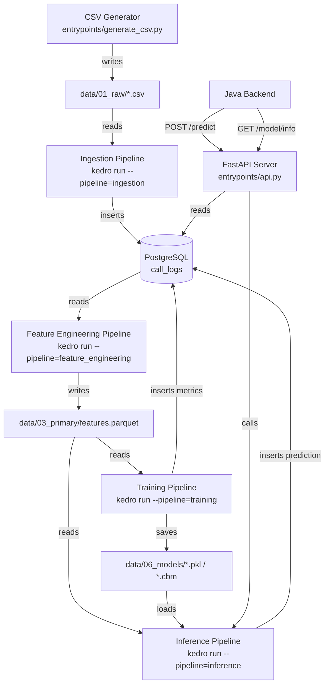

# Design Document: ML Service

## Overview

The ML Service is the Python-based machine learning backbone of WeMakeCalls. It is responsible for the full MLOps lifecycle: generating synthetic training data, ingesting CSV files into PostgreSQL, engineering time-series features, training forecasting models, running hourly inference, and exposing predictions via a FastAPI REST API.

The service is built on three pillars:

- **Kedro** for reproducible, configurable ML pipeline orchestration
- **FastAPI + Uvicorn** for a lightweight, async-capable REST API
- **CatBoost / XGBoost / LightGBM / scikit-learn** for the forecasting model layer

It runs as a Docker container within the WeMakeCalls Compose stack, reading configuration exclusively from environment variables and Kedro's `conf/base/` YAML files.

---

## Architecture

The service is structured as a single Python package (`wemakecalls`) with four Kedro pipelines and one FastAPI application. All pipelines share a common data layer defined in `catalog.yml`.



### Key Design Decisions

**Kedro for pipeline orchestration**: Kedro enforces separation between node logic and I/O, making every pipeline step independently testable as a pure function. The catalog abstracts all file and database paths, so no path is hardcoded in source code.

**FastAPI for the REST layer**: FastAPI's Pydantic v2 integration provides automatic request validation and OpenAPI documentation with zero boilerplate. The async server (Uvicorn) handles concurrent requests from the Java backend without blocking.

**Model-agnostic training interface**: A factory function maps `model_type` strings to model classes, making it trivial to add new model types without modifying pipeline logic.

**Parquet for intermediate data**: PyArrow Parquet provides schema enforcement, efficient columnar storage, and lossless round-trip serialisation for the feature vector dataset.

---

## Components and Interfaces

### Project Layout

```
ml-service/
├── conf/
│   └── base/
│       ├── catalog.yml          # All dataset definitions
│       └── parameters.yml       # Model config, lag params, inference settings
├── data/
│   ├── 01_raw/                  # Raw CSV files
│   ├── 03_primary/              # features.parquet
│   ├── 06_models/               # Trained model artifacts
│   └── 07_model_output/         # Prediction output files (optional)
├── src/
│   └── wemakecalls/
│       ├── __init__.py
│       ├── pipeline_registry.py # Registers all four Kedro pipelines
│       └── pipelines/
│           ├── __init__.py
│           ├── csv_generator.py     # Synthetic data generation
│           ├── ingestion/
│           │   ├── __init__.py
│           │   ├── nodes.py         # Pure ingestion functions
│           │   └── pipeline.py      # Kedro pipeline definition
│           ├── feature_engineering/
│           │   ├── __init__.py
│           │   ├── nodes.py
│           │   └── pipeline.py
│           ├── training/
│           │   ├── __init__.py
│           │   ├── nodes.py
│           │   ├── model_factory.py # Maps model_type -> model class
│           │   └── pipeline.py
│           └── inference/
│               ├── __init__.py
│               ├── nodes.py
│               └── pipeline.py
├── entrypoints/
│   ├── generate_csv.py          # CLI: python entrypoints/generate_csv.py
│   ├── api.py                   # FastAPI app + Uvicorn startup
│   └── startup_check.py         # DATABASE_URL validation at container start
├── logs/
│   └── pipeline.log             # Structured JSON error log
├── tests/
│   ├── unit/
│   │   ├── test_csv_generator.py
│   │   ├── test_ingestion_nodes.py
│   │   ├── test_feature_engineering_nodes.py
│   │   ├── test_training_nodes.py
│   │   ├── test_inference_nodes.py
│   │   └── test_api.py
│   └── property/
│       ├── test_csv_generator_props.py
│       ├── test_ingestion_props.py
│       ├── test_feature_engineering_props.py
│       ├── test_training_props.py
│       ├── test_inference_props.py
│       └── test_api_props.py
├── Dockerfile
├── pyproject.toml
└── README.md
```

### CSV Generator (`csv_generator.py`)

```python
def generate_call_logs(
    start_date: date,
    end_date: date,
    row_count: int,          # 1 <= row_count <= 10_000_000
    output_dir: Path = Path("data/01_raw"),
) -> Path:
    """Generate synthetic call log CSV. Returns path to written file."""
```

The generator uses NumPy's random number generator with a weighted hourly distribution (higher weights for 08:00–18:00). Duration values are drawn from a log-normal distribution, clipped to [30, 1800] for non-abandoned calls. Abandoned rows have `duration_seconds` forced to 0 and `hangup_reason` forced to `"Call Dropped"`.

### Ingestion Pipeline Nodes (`ingestion/nodes.py`)

```python
def validate_columns(df: pd.DataFrame) -> pd.DataFrame:
    """Raise ValueError naming missing columns. Returns df unchanged."""

def parse_and_clean(df: pd.DataFrame) -> pd.DataFrame:
    """Parse datetimes, drop null call_id/datetime rows, log counts."""

def deduplicate(df: pd.DataFrame, engine: Engine) -> pd.DataFrame:
    """Remove rows whose call_id already exists in call_logs."""

def insert_to_postgres(df: pd.DataFrame, engine: Engine) -> dict:
    """Batch-insert surviving rows with source='csv_import'. Returns summary dict."""
```

### Feature Engineering Pipeline Nodes (`feature_engineering/nodes.py`)

```python
def aggregate_hourly(call_logs: pd.DataFrame) -> pd.DataFrame:
    """Group by hour bucket, compute call_count, avg_duration, abandonment_rate."""

def compute_lag_features(hourly: pd.DataFrame, lag_windows: list[int]) -> pd.DataFrame:
    """Add calls_lag_Nh columns for each window in lag_windows."""

def compute_calendar_features(hourly: pd.DataFrame, holidays: list[str]) -> pd.DataFrame:
    """Add hour_of_day, day_of_week, is_weekend, is_holiday columns."""

def compute_rolling_avg(hourly: pd.DataFrame) -> pd.DataFrame:
    """Add rolling_avg_7d column."""

def fill_missing_features(features: pd.DataFrame) -> pd.DataFrame:
    """Fill all NaN values with 0. Assert no nulls remain."""

def validate_feature_ranges(features: pd.DataFrame) -> pd.DataFrame:
    """Assert hour_of_day in [0,23], day_of_week in [0,6], abandonment_rate in [0,1]."""
```

### Training Pipeline Nodes (`training/nodes.py`)

```python
def create_target(features: pd.DataFrame) -> pd.DataFrame:
    """Shift call_count by -1 to create next_hour_calls. Drop last row."""

def temporal_split(features: pd.DataFrame, ratio: float) -> tuple[pd.DataFrame, pd.DataFrame]:
    """Split into train (first ratio%) and test (last 1-ratio%) preserving order."""

def train_model(X_train, y_train, model_type: str, params: dict) -> Any:
    """Instantiate and fit model via model_factory. Returns fitted model."""

def evaluate_model(model, X_test, y_test) -> dict:
    """Compute MAE, RMSE, MAPE. Returns metrics dict."""

def save_model_artifact(model, model_type: str, trained_at: datetime) -> Path:
    """Serialise model to data/06_models/. Returns artifact path."""
```

### Model Factory (`training/model_factory.py`)

```python
SUPPORTED_MODELS = {
    "catboost": CatBoostRegressor,
    "xgboost": XGBRegressor,
    "lightgbm": LGBMRegressor,
    "random_forest": RandomForestRegressor,
    "linear_regression": LinearRegression,
}

def get_model(model_type: str, params: dict) -> Any:
    """Return instantiated model. Log WARNING and fall back to catboost if unsupported."""
```

### Inference Pipeline Nodes (`inference/nodes.py`)

```python
def load_latest_model(models_dir: Path) -> tuple[Any, str]:
    """Load most recently modified artifact. Validate with all-zero test prediction."""

def build_prediction_batch(features: pd.DataFrame) -> pd.DataFrame:
    """Select single most recent row. Fill nulls with 0."""

def run_inference(model: Any, batch: pd.DataFrame) -> int:
    """Predict and return non-negative integer call count."""

def persist_prediction(prediction: int, model_type: str, engine: Engine) -> None:
    """Insert prediction row into PostgreSQL predictions table."""
```

### FastAPI Application (`entrypoints/api.py`)

```python
# Pydantic v2 request/response models
class FeatureVector(BaseModel):
    calls_lag_1h: float
    calls_lag_2h: float
    calls_lag_24h: float
    calls_lag_168h: float
    hour_of_day: int
    day_of_week: int
    is_weekend: bool
    is_holiday: bool
    rolling_avg_7d: float
    avg_duration_lag_1h: float
    abandonment_rate_lag_1h: float

class PredictionResponse(BaseModel):
    predicted_calls: int
    target_hour: str   # ISO 8601 UTC
    model_type: str

class ModelInfoResponse(BaseModel):
    model_type: str
    trained_at: str    # ISO 8601 UTC
    mae: float
    rmse: float
    mape: float

# Endpoints
POST /predict       -> PredictionResponse  (HTTP 200 | 422 | 503)
GET  /health        -> {"status": "ok"}    (HTTP 200)
GET  /model/info    -> ModelInfoResponse   (HTTP 200 | 503)
```

The FastAPI app loads the model artifact at startup into a module-level `ModelState` object. This avoids reloading the model on every request and allows the `/model/info` endpoint to return cached metadata.

---

## Data Models

### PostgreSQL Schema

```sql
-- Existing table (managed by Java backend / Flyway)
CREATE TABLE call_logs (
    id               SERIAL PRIMARY KEY,
    call_id          VARCHAR(64) UNIQUE NOT NULL,
    started_at       TIMESTAMPTZ NOT NULL,
    ended_at         TIMESTAMPTZ,
    duration_seconds INTEGER,
    queue_name       VARCHAR(64),
    agent_id         VARCHAR(16),
    wait_time_seconds INTEGER,
    abandoned        BOOLEAN,
    hangup_reason    VARCHAR(128),
    hour_bucket      TIMESTAMPTZ,
    source           VARCHAR(32) NOT NULL  -- 'csv_import' | 'simulator'
);

-- Existing table (managed by Java backend / Flyway)
CREATE TABLE predictions (
    id               SERIAL PRIMARY KEY,
    predicted_at     TIMESTAMPTZ NOT NULL,
    target_hour      TIMESTAMPTZ,
    predicted_calls  INTEGER,
    actual_calls     INTEGER,
    model_type       VARCHAR(64),
    mae              FLOAT,
    rmse             FLOAT,
    mape             FLOAT
);
```

The ML service reads from `call_logs` and writes to `predictions`. It does not own schema migrations — those are managed by the Java backend's Flyway configuration.

### Feature Vector Schema

| Column | dtype | Description |
|---|---|---|
| `hour_bucket` | `datetime64[ns, UTC]` | Hour window start (index) |
| `call_count` | `int64` | Calls in this hour |
| `calls_lag_1h` | `float64` | call_count 1h prior |
| `calls_lag_2h` | `float64` | call_count 2h prior |
| `calls_lag_24h` | `float64` | call_count 24h prior |
| `calls_lag_168h` | `float64` | call_count 168h prior |
| `hour_of_day` | `int64` | 0–23 |
| `day_of_week` | `int64` | 0 (Mon) – 6 (Sun) |
| `is_weekend` | `bool` | True when day_of_week in {5, 6} |
| `is_holiday` | `bool` | True when date in holidays list |
| `rolling_avg_7d` | `float64` | Mean call_count same hour over 7 prior days |
| `avg_duration_lag_1h` | `float64` | Mean duration_seconds 1h prior |
| `abandonment_rate_lag_1h` | `float64` | Abandonment ratio 1h prior, in [0.0, 1.0] |

### Kedro Catalog (`catalog.yml`)

```yaml
raw_call_logs:
  type: pandas.CSVDataset
  filepath: data/01_raw/call_history_${year}.csv

feature_vectors:
  type: pandas.ParquetDataset
  filepath: data/03_primary/features.parquet
  load_args:
    engine: pyarrow
  save_args:
    engine: pyarrow

model_artifact:
  type: pickle.PickleDataset
  filepath: data/06_models/model.pkl
  backend: joblib

prediction_output:
  type: pandas.ParquetDataset
  filepath: data/07_model_output/predictions.parquet
```

### Kedro Parameters (`parameters.yml`)

```yaml
model_type: catboost
lag_windows: [1, 2, 24, 168]
train_test_split_ratio: 0.8
inference_interval_minutes: 60
holidays:
  - "2024-01-01"
  - "2024-12-25"
  # ... additional dates
```

### Structured Log Entry Schema

```json
{
  "timestamp": "2024-01-15T08:03:00Z",
  "pipeline": "ingestion",
  "level": "ERROR",
  "message": "Database connection failed after 3 retries: ..."
}
```

---

## Correctness Properties

*A property is a characteristic or behavior that should hold true across all valid executions of a system — essentially, a formal statement about what the system should do. Properties serve as the bridge between human-readable specifications and machine-verifiable correctness guarantees.*

PBT is applicable to this feature. The ML service contains substantial pure-function logic in its pipeline nodes (data transformation, feature engineering, model evaluation) that is well-suited to universal quantification over generated inputs. The PBT library used is **Hypothesis** (`hypothesis` + `hypothesis[pandas]`).

**Property Reflection** — Before writing properties, redundant criteria are consolidated:

- Requirements 3.7 and 3.10 both assert no null values in feature columns after fill logic — consolidated into **Property 7**.
- Requirements 8.2, 8.3, and 8.4 assert range invariants on specific feature columns — consolidated into **Property 8** (feature range invariants).
- Requirements 2.1 and 2.2 both concern column validation — consolidated into **Property 3** (missing column detection).
- Requirements 1.7, 1.8, and 1.9 all assert value-set membership for generated fields — consolidated into **Property 2** (generated field domain constraints).

### Property 1: Generated CSV row count and datetime bounds

*For any* valid combination of `start_date`, `end_date`, and `row_count` (where `row_count` is in [1, 10,000,000] and `start_date <= end_date`), the CSV generator SHALL produce a file containing exactly `row_count` data rows, and every `datetime` value in those rows SHALL fall within the inclusive range [`start_date`, `end_date`].

**Validates: Requirements 1.2**

### Property 2: Generated CSV field domain constraints

*For any* generated CSV file, every row SHALL satisfy all of the following simultaneously:
- `queue_name` is in `{"billing", "support", "sales", "technical"}`
- `agent_id` is in `{"A01", "A02", ..., "A20"}`
- `hangup_reason` is in `{"Issue Resolved", "Wrong Department", "Long Wait Time", "Call Dropped", "Other"}`
- When `abandoned` is `True`, `duration_seconds` equals `0` and `hangup_reason` equals `"Call Dropped"`
- When `abandoned` is `False`, `duration_seconds` is an integer in `[30, 1800]`

**Validates: Requirements 1.4, 1.6, 1.7, 1.8, 1.9**

### Property 3: Ingestion column validation names missing columns

*For any* subset of the 8 required columns that is absent from a CSV file, the Ingestion Pipeline SHALL raise an error, and the error message SHALL contain the name of every missing column. No rows SHALL be inserted into `call_logs` when column validation fails.

**Validates: Requirements 2.1, 2.2**

### Property 4: Ingestion null-drop and source tagging

*For any* CSV file that passes column validation, every row inserted into `call_logs` SHALL have a non-null `call_id`, a parseable `datetime`, and `source` equal to `"csv_import"`. Rows with null `call_id` or unparseable `datetime` SHALL NOT appear in the inserted data.

**Validates: Requirements 2.4, 2.5**

### Property 5: Hourly aggregation produces one row per hour bucket

*For any* set of `call_logs` records, the Feature Engineering Pipeline's aggregation step SHALL produce exactly one output row per distinct hour bucket, and the `call_count` for each bucket SHALL equal the number of input records whose `started_at` truncates to that hour.

**Validates: Requirements 3.1**

### Property 6: Lag features match prior hour bucket call counts

*For any* hourly call series with sufficient history, `calls_lag_Nh` for row `i` SHALL equal the `call_count` of the row at offset `i - N` in the series. When the prior row does not exist (insufficient history), the lag value SHALL be `0`.

**Validates: Requirements 3.2, 3.7**

### Property 7: Feature vector contains no null values

*For any* feature vector dataset produced by the Feature Engineering Pipeline, every feature column SHALL contain zero null values after fill logic is applied.

**Validates: Requirements 3.7, 3.10**

### Property 8: Feature column range invariants

*For any* feature vector dataset produced by the Feature Engineering Pipeline:
- Every `hour_of_day` value SHALL be an integer in the closed range `[0, 23]`
- Every `day_of_week` value SHALL be an integer in the closed range `[0, 6]`
- Every `abandonment_rate_lag_1h` value SHALL be a float in the closed range `[0.0, 1.0]`

**Validates: Requirements 8.2, 8.3, 8.4**

### Property 9: Calendar features are correctly derived from timestamps

*For any* Hour_Bucket timestamp, the computed calendar features SHALL satisfy:
- `hour_of_day` equals the hour component of the timestamp (0–23)
- `day_of_week` equals the ISO weekday minus 1 (Monday = 0, Sunday = 6)
- `is_weekend` is `True` if and only if `day_of_week` is in `{5, 6}`
- `is_holiday` is `True` if and only if the date component of the timestamp appears in the configured holidays list

**Validates: Requirements 3.3**

### Property 10: Feature vector Parquet round-trip

*For any* feature vector DataFrame, writing it to Parquet using PyArrow and reading it back SHALL produce a DataFrame with identical column names, identical dtypes, identical row count, and identical values in every cell.

**Validates: Requirements 3.9**

### Property 11: Training target creation

*For any* hourly call series of length N (N >= 2), the `next_hour_calls` target for row `i` SHALL equal the `call_count` of row `i + 1`, and the output DataFrame SHALL have exactly `N - 1` rows (the last row is dropped because it has no target).

**Validates: Requirements 4.1**

### Property 12: Temporal train/test split preserves order

*For any* feature vector dataset of length N and split ratio `r` in `(0.0, 1.0)`, the training set SHALL consist of the first `floor(N * r)` rows and the test set SHALL consist of the remaining rows, with no row appearing in both sets and temporal order preserved throughout.

**Validates: Requirements 4.2**

### Property 13: Evaluation metrics are non-negative

*For any* trained model and test set, the computed MAE, RMSE, and MAPE SHALL all be non-negative floats.

**Validates: Requirements 4.6**

### Property 14: Deterministic model reproducibility

*For any* fixed feature vector dataset and a deterministic model type (`linear_regression` or `random_forest` with fixed `random_state`), running the Training Pipeline twice SHALL produce two Model Artifacts whose MAE values on the same test set differ by no more than 1% in relative terms.

**Validates: Requirements 4.9**

### Property 15: Inference returns non-negative integer

*For any* valid feature vector row (with all feature columns present and non-null), the Inference Pipeline SHALL return a single non-negative integer as the predicted call count.

**Validates: Requirements 5.4**

### Property 16: Inference null-fill before prediction

*For any* Prediction Batch that contains null values in one or more feature columns, the Inference Pipeline SHALL replace all null values with `0` before calling `model.predict()`. The model SHALL never receive a batch containing null values.

**Validates: Requirements 5.6**

### Property 17: POST /predict response contract

*For any* valid `FeatureVector` submitted to `POST /predict` (with a model loaded), the API Server SHALL return HTTP 200 with a JSON body containing `predicted_calls` (a non-negative integer), `target_hour` (a valid ISO 8601 UTC string), and `model_type` (a non-empty string).

**Validates: Requirements 6.2**

### Property 18: POST /predict validation rejects incomplete requests

*For any* request body submitted to `POST /predict` that is missing one or more of the 11 required feature fields, the API Server SHALL return HTTP 422, and the response body SHALL name every missing field.

**Validates: Requirements 6.3, 6.10**

### Property 19: GET /model/info response contract

*For any* loaded Model Artifact, `GET /model/info` SHALL return HTTP 200 with a JSON body containing all five required fields: `model_type` (string), `trained_at` (ISO 8601 UTC string), `mae` (float), `rmse` (float), `mape` (float).

**Validates: Requirements 6.6**

### Property 20: model_type parameter drives model selection

*For any* supported `model_type` value (`catboost`, `xgboost`, `lightgbm`, `random_forest`, `linear_regression`) set in `parameters.yml`, the Training Pipeline SHALL instantiate and train a model of exactly that type without requiring any source code changes.

**Validates: Requirements 7.3**

---

## Error Handling

### Startup Validation

At container startup, `entrypoints/startup_check.py` reads `DATABASE_URL` from the environment. If the variable is absent or empty, it prints a descriptive message to `stderr` and calls `sys.exit(1)` before the FastAPI server or any pipeline is started.

### Pipeline Error Handling

All pipeline errors are caught at the node boundary and written to `logs/pipeline.log` as structured JSON entries before being re-raised. This ensures the Kedro runner surfaces the error while preserving a machine-readable audit trail.

| Error Condition | Behaviour |
|---|---|
| Missing CSV columns | `ValueError` naming missing columns; no rows inserted |
| Null `call_id` or `datetime` | Row silently dropped; count logged at INFO |
| Unparseable `datetime` | Row dropped; count logged at WARNING |
| Duplicate `call_id` | Row skipped; duplicate counter incremented |
| DB connection failure | Retry 3× with 5s delay; fatal error after 3rd failure |
| DB batch insert failure | Full batch rolled back; error raised |
| Feature vector < 168 rows | `ValueError` with actual and minimum row counts |
| Unsupported `model_type` | WARNING logged; fallback to `catboost` |
| Missing `features.parquet` | `FileNotFoundError` with remediation instructions |
| Empty `data/06_models/` | `FileNotFoundError` with remediation instructions |
| Corrupted model artifact | `RuntimeError` identifying artifact path |

### API Error Handling

| Condition | HTTP Status | Response Body |
|---|---|---|
| Missing/invalid request fields | 422 | Pydantic validation error with field names |
| No model loaded | 503 | `{"detail": "Model not available. Run training pipeline first."}` |
| Internal inference error | 500 | `{"detail": "Internal server error"}` |

---

## Testing Strategy

### Dual Testing Approach

The test suite uses both example-based unit tests and property-based tests. Unit tests cover specific scenarios, integration points, and error conditions. Property tests verify universal invariants across randomly generated inputs.

**Property-based testing library**: `hypothesis` with `hypothesis[pandas]` for DataFrame strategies.

**Minimum iterations per property test**: 100 (Hypothesis default `max_examples=100`).

**Tag format for property tests**:
```python
@settings(max_examples=100)
@given(...)
def test_property_N_description():
    """Feature: ml-service, Property N: <property_text>"""
```

### Unit Tests

| Test File | Coverage |
|---|---|
| `test_csv_generator.py` | Column order, file naming, overwrite warning, UTF-8 encoding |
| `test_ingestion_nodes.py` | Column validation error messages, retry logic, batch rollback, summary logging |
| `test_feature_engineering_nodes.py` | Parquet output path, range assertion errors, zero-call edge cases |
| `test_training_nodes.py` | Each model type instantiation, unsupported type fallback, artifact naming, metrics logging |
| `test_inference_nodes.py` | Most-recent-model selection, missing model error, missing features error, corrupted artifact detection |
| `test_api.py` | /health response, /predict with no model (503), /model/info with no model (503) |

### Property Tests

| Test File | Properties Covered |
|---|---|
| `test_csv_generator_props.py` | Properties 1, 2 |
| `test_ingestion_props.py` | Properties 3, 4 |
| `test_feature_engineering_props.py` | Properties 5, 6, 7, 8, 9, 10 |
| `test_training_props.py` | Properties 11, 12, 13, 14 |
| `test_inference_props.py` | Properties 15, 16 |
| `test_api_props.py` | Properties 17, 18, 19 |

### Integration Tests

- Ingestion of a 100,000-row CSV completes within 60 seconds (Requirement 2.8)
- Single inference run completes within 5 seconds excluding DB write (Requirement 5.8)
- API response time under 2 seconds for `/predict` and `/model/info` (Requirement 6.9)

### Running Tests

```bash
# All tests
uv run pytest tests/

# Unit tests only
uv run pytest tests/unit/

# Property tests only
uv run pytest tests/property/

# With coverage
uv run pytest --cov=wemakecalls tests/
```
